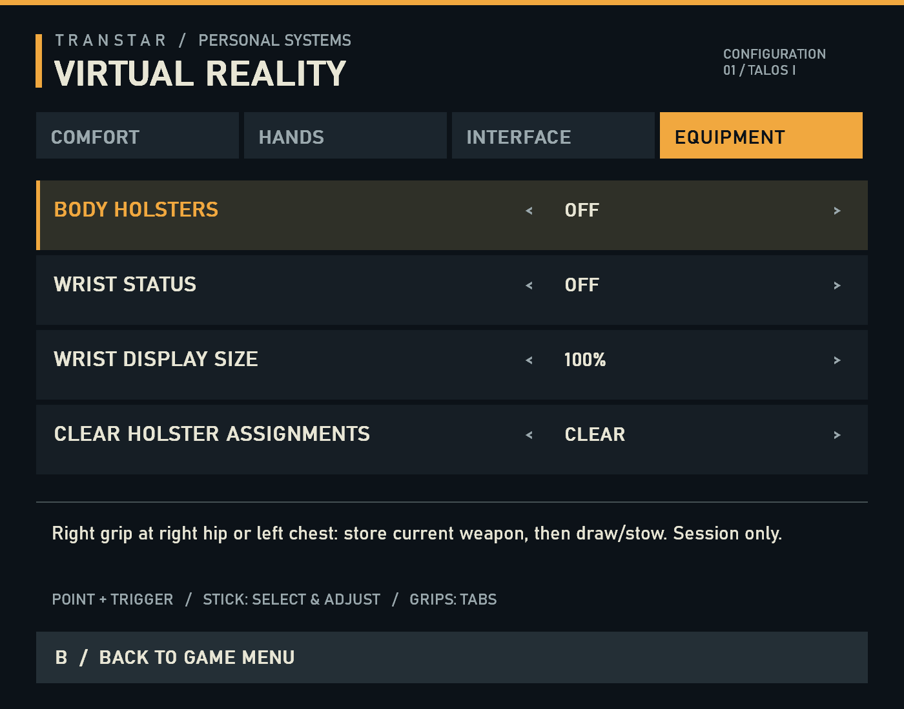
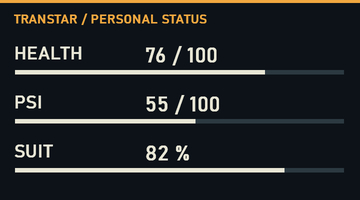

# Optional body holsters and wrist status

Built on `codex/vr-options`, following commit `14c1075`. No Prey launch,
injection, game attachment or headset testing was performed in this batch.

**September 28 update:** the custom wrist card described below is superseded by
the [native HUD capture candidate](NATIVE-WRIST-IMPLEMENTATION-2026-09-28.md).
That path uses native pixels, not the stats polling/GDI painter documented here.
Holster controls are unchanged. Historical validation below belongs to this
September 27 prototype; see the new note for the current wrist implementation.

## Controls and presentation

The fourth **Equipment** tab enables holsters and wrist status independently,
changes wrist size (80–140%), and clears holster assignments. Both features
default off; preferences save in the existing local VR options file. Older
version-1 files load with both new features off.



Use the **right grip** at the right hip or left chest. An empty slot stores the
current validated local weapon and requests native stowing. Subsequent fresh
squeezes draw that weapon, or stow it if already equipped. Slots can switch
between two weapons through the normal equip transition. Clear assignments to
bind different weapons. Assignments stay in memory only; equipment stays in the
native inventory. No scene props, back holster, haptics or dual wielding are added.

Zones are 14 cm spheres at head-relative offsets `(0.25,-0.65,0.02)` and
`(-0.20,-0.30,-0.13)` metres in XR axes. Their inferred torso yaw has a 45-degree
head-turn deadband and follows at at most 90 degrees/second away from zones.
It freezes while gripping or reaching a zone. Head pitch/roll do not rotate the
zones. This is a torso estimate requiring seated/standing ergonomic acceptance,
not a tracked body or a universal anthropometric calibration.

Grip must first be released, then pressed inside a zone. Held grip cannot acquire
a slot by drifting into it, or trigger another slot. Grip ownership suppresses
use/reload until release, including after leaving the zone. Tracking loss, stale
input, menus, recenter, left support squeeze, active two-handed aim, trigger or
face buttons invalidate recognition. Pending requests carry tracking epoch,
reference generation and timestamp; the live player hook rejects stale requests.

Slots reset on feature changes, explicit clear, XR teardown/epoch, player or
inventory-owner changes. Drawing re-resolves the entity through the native
weapon lookup and checks the stored whole-weapon pointer, item ID and local owner
before calling Equip. Removed/transferred items clear that slot. An animation in
progress refuses another request. Save/load behavior still needs live testing;
there is deliberately no cross-session entity-ID persistence.

Turn the **left palm up** and look at the wrist for a 18 × 10 cm card at default
size. Its grip-local offset is 4.5 cm above the hand and 11 cm toward the forearm.
The card follows the current coherent XR hand sample, with front-facing and gaze
threshold hysteresis. It hides outside 23–100 cm eye distance, during menus or
two-hand aiming, and on missing/stale tracking or stats. It is a compositor quad,
so it is not depth-occluded by scene geometry. Native HUD widgets remain intact.



**Presentation direction:** this custom card is a prototype. The requested end
state is Prey's own HUD status widgets rendered on the wrist, retaining their
art and animation. See [native HUD retargeting](NATIVE-WRIST-HUD-2026-09-27.md)
for the established update routes and the remaining widget-isolation boundary.

The screenshot uses synthetic values through the production rasterizer, not a
game capture. Health/psi/suit values in the mod come from the Steam native paths
below. Unknown values display `--`, not zero. Native stats are sampled at up to
10 Hz; GDI repaint and GPU upload happen only when visible values change. Pose
submission updates each XR frame. The sRGB BGRA/RGBA path explicitly swizzles
channels as needed and uses the existing bounded inventory swapchain owner.
Swapchain and texture are destroyed before the session.

## Static native contracts

Target: Steam x64 `PreyDll.dll`, image base `0x180000000`, SHA-256
`7D6E322F61B28331095A400F0BA5F09BD9A39C57BF993602285DD6ACB05311A7`.
Addresses below are RVAs. EGS symbols and normalized function matches supplied
search leads; target decompilation and Steam instruction bytes settled contracts.

| Producer / consumer | Established contract |
|---|---|
| Input action `158FC00` | Live input owner +70; items-restricted player +7BC; cinematic input +94; passes player +14B8 to Equip with item ID in EDX |
| Equip `1274820`, EquipWeapon `12748D0` | `bool(component*, uint32 item)`; normal item/weapon resolution, IsEquippable, equip transition and native CanEquip handling |
| CanEquip `1273EB0` | Native pause, animation, interactions, cinematic and related gates; called before either holster operation |
| Use action `1590DD0`, Unequip `12773A0` | Native stow is `void(player+14B8, true, false)`; component +78 prevents duplicate unequip; selected ID +58; player backlink +48 |
| Weapon lookup `16A5650` | Converts item secondary interface to whole CArkWeapon with -8 adjustment; existing rig evidence proves whole-weapon item +38 and owner +60 |
| Health getter `158B4D0`, HUD producer `158CAB0` | Health extension value +40 returned in XMM0; HUD displays ceil(value × 0.1), not raw internal value |
| Maximum health `158B4F0` | Native effective maximum includes reductions and god-mode policy; float result in XMM0 |
| Script consumer `15E8060`, accessor `10839F0` | Psi component is first pointer in player component at player +678 |
| Psi getters `15ACFE0` / `15ACFA0` | Float points +400 / maximum +408, native upward rounding |
| Player armor UI `1584720`, status accessor `1587CA0` | Player +678 -> status owner +C0 -> native find-status `148F000`, type 11 |
| Armor HUD producer `13611D0` | `100 × (1 - damage / maximum)`; damage at status +18, maximum from property getter `10B1F40(status+30)` |

Runtime checks the complete bodies of 22 native functions/consumers against
fixed FNV-1a hashes. This is a compatibility guard, not a cryptographic identity
check; startup's exact-build gate and the offline SHA-256 verifier establish
identity. The live hook also checks its thread, player singleton identity and
embedded input vtable/backlink. No new virtual slots are guessed. SEH/byte
failures disarm these features for the process instead of repeatedly calling.

`vr.options` reports feature settings, holster slots, dispatched/refused requests,
equipment fault state, wrist samples and successful wrist-layer submissions.
Dispatched is not proof the animation completed. Layer frames are not headset
acceptance. Increasing samples with zero layer frames points toward wrist pose,
visibility or presentation gating rather than a missing stats source.

## Verification and remaining acceptance

- Release DLL builds; final 49/49 offline CTest checks passed. DLL size:
  1,026,048 bytes; SHA-256:
  `3BB7ED3BD21E2EBC1111006996B20BAC29F282181A6940DB95260D8AE5FFCE1F`.
  Full log: [CTest](evidence/body-equipment-2026-09-27/ctest.txt).
- Pure tests exercise neutral entry, held grip, drift into zones, modal/tracking
  cancellation, frame stalls, yaw invariance, wrist front/back/distance/gaze and
  health rounding.
- Runtime options harness exercises both feature toggles, clear action and disk
  persistence. Four-tab hit testing checks that Equipment is not the old close ID.
- Production GDI raster tests distinguish genuine zero from unavailable values
  and check resource stability. Both previews were visually inspected.
- The independent PE verifier checks 22 whole function bodies, changed-byte
  negative controls and eight semantic anchors against the exact Steam SHA-256.

Reproduce without launching a game:

```powershell
python tools/re/verify_body_equipment.py
cmake --build build/integration --config Release --target preyvr preyvr_body_equipment_tests preyvr_wrist_panel_tests preyvr_vr_options_tests preyvr_vr_options_panel_tests preyvr_vr_options_runtime_tests
ctest --test-dir build/integration -C Release --output-on-failure
```

Pending authorized live/headset checks: both slots with different owned weapons;
stow completion and draw after unequip; dropped/removed equipment; save/load and
level transitions; two-hand/reload/recenter conflicts; body-zone reach while
seated, standing and turning; wrist values against native HUD, psi unlock and
suit-disabled modes; card orientation, legibility and occlusion acceptability.

Project graph refresh and fleet receipt intake remain deferred until this work
reaches the canonical checkout; the fleet tools reject this unregistered worktree
root. Static receipt validation works locally and does not claim live acceptance.
