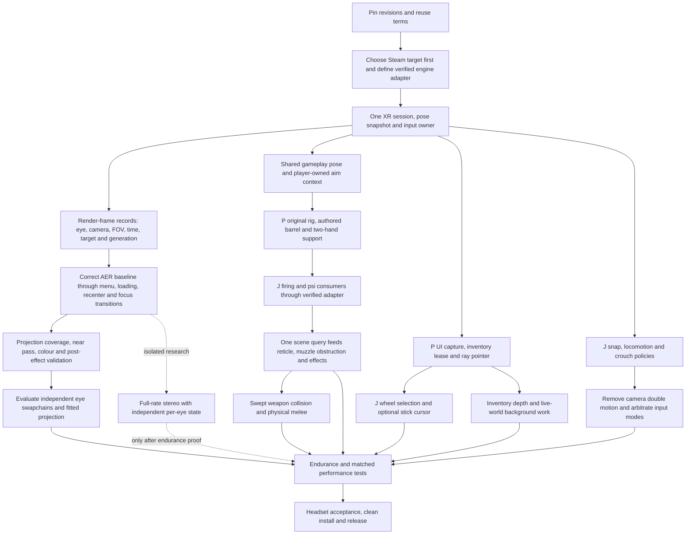

# Prey VR implementation comparison and integration plan

Date: 2026-09-16. Read-only source review; no game launch, deployment, or new headset test. Recommendations are for a combined implementation, not a claim that either current build is complete.

## Decision

**Use phunkaeg/PreyVR as the integration base. Retain its original arm/weapon rig, coherent gameplay pose sampling, two-handed solver, isolated HUD/PDA capture, controller-ray UI, and launch/diagnostic framework. Adapt Jordi's locomotion corrections, snap-turn policy, physical-crouch state machine, native focus-wheel selection, psi targeting seams, and weapon-specific consumer knowledge.**

Do not combine the DLLs or install both hook stacks. Establish one owner for camera, input, rendering, and each gameplay consumer. Neither implementation supplies a finished full-rate stereo renderer, physical melee, or a fully spatial inventory with correct internal head-motion parallax.

The highest-value contribution from Jordi's code is gameplay integration and the engine consumers it identifies. The highest-value contribution from ours is the rig/UI infrastructure and testable contracts. Jordi's independent-eye swapchains and symmetric coverage projection are promising performance techniques, but require corrections and measurement before adoption.

## Scope, identity, and attribution

| Label | Inspected checkout | Identity |
|---|---|---|
| **P** | `D:/Dev Debug/PreyVR` | `1ac2d6103d97f1321f991c46f2ccae8bbae6a115` **plus current uncommitted changes**, including September 13 inventory and September 14 two-hand work |
| **J** | `D:/Dev Debug/Other VR Mods/prey-vr` | Clean `master`, `b680f8bcb70d2deb6910c497d38e54d26683f933`; local `origin/stage-6` points to the same commit |

J's root README describes an older flat-screen build. Its latest HANDOFF, actual source, and git history supersede that description. Older remote branch tips were inventoried, not treated as additional current products. P's public 0.5.0 is not the same as the inspected development tree. Source hashes and checkout state are recorded in [the audit manifest](evidence/prey-vr-comparison-20260916/manifest.json).

Git authors are `phunkaeg` for P's committed history and `jordicalsina` for J's. Below, **P team** means the maintainers of our implementation, and **Jordi** means the maintainer represented by that second history. This is a proposed division of work based on demonstrated code, not proof of individual authorship of every line, a ranking of people, or an assignment already communicated to anyone. P includes mixed Codex/Claude-assisted and uncommitted work.

P explicitly targets Steam PreyDll SHA-256 `7d6e322f61b28331095a400f0ba5f09bd9a39c57bf993602285dd6acb05311a7`. J's documented installation patches Steam's DLL to Chairloader's EGS-compatible build. J's local dependency/binary bundle is not included here; its exact target binary hash was not independently established. **Offsets, layouts and member-call signatures must be re-proved for the chosen target.** Source-level names are valuable leads, not portable ABI guarantees.

J's README says its project license is TBD. Agree reuse/attribution terms before copying or redistributing its code. This review does not copy implementation code or modify the donor repository. No new download, public upload, or publication was performed.

## Ranking method

Each feature gets **Q/C** scores from 0–5:

- **Q: implementation completeness/correctness readiness**, based on inspected paths and explicit known defects. 0 absent, 1 exploratory, 2 partial/major gap, 3 usable with material limitations, 4 strong scoped implementation, 5 broadly accepted production implementation. These are not measured visual-quality scores.
- **C: code robustness/testability**, considering ownership, lifecycle, explicit error handling, coherent state, test separation and maintainability. 0 absent; 1 fragile prototype; 2 substantial unguarded assumptions; 3 reasonable but incomplete; 4 explicit contracts/tests; 5 broad regression and portability evidence. Tests do not establish target ABI correctness by themselves.
- **Performance** is a source-based cost assessment or **unknown**, not invented FPS. No matched GPU/headset/scene benchmark was run. No weighted overall score: stereo correctness is a gate, not something good menus can average away.

HMD reports in J's documents remain **author-reported** here. P's earlier captures/receipts are scenario-specific historical evidence, not a fresh run of every current file. P's September 14 receipt explicitly records an unresolved baseline rendering band and a simulator per-hand float-action limitation. It does not certify projectile accuracy or headset comfort.

## Feature rankings and selections

| Feature | P Q/C | J Q/C | Performance / quality distinction | Selection |
|---|---:|---:|---|---|
| World stereo | 3/3 | 2/2 | Both normal paths alternate eyes: each eye refreshes every other game render. P retains two images and copies both into an array; J updates one eye swapchain and reuses the other's last released image. J has lower copy-count potential, but documented pairing starvation remains. | **P baseline; J independent-eye storage design after frame-contract work.** |
| Projection / resolution | 3/3 | 3/2 | P declares native rendered tangents and uses a taller launcher backbuffer; runtime-frustum path is opt-in. J fits symmetric coverage with pixel aspect, then crops native eye FOV, potentially spending more pixels on visible content. Neither is a universal headset solution yet. | **Hybrid:** retain P coverage diagnostics; evaluate J coverage fit with corrected crop/FOV math. |
| Full-rate stereo | 1/2 | 1/2 | Both contain experiments and documented render-thread deadlocks. A double render also raises GPU scene cost. | **Neither ready.** Separate research branch; keep working AER fallback. |
| Head 6DoF / reference space | 3/4 | 3/3 | Both map tracked translation and decouple aim. P uses freshness/reference generations; J's rigid tracking-to-world mapping is clear. Neither establishes collision-safe room-scale body following. | **P ownership/sampling, with J's rigid-transform formulation as a cross-check.** |
| Original arm + weapon rig | 4/4 | 2/2 | P drives original wrists and authored weapon/barrel alignment. J's main path spawns a separate 1P model entity and hides the rig; source shows no equivalent native animation-state synchronization. Rig CPU cost needs measurement. | **P.** J separate entity only as an explicit fallback for unsupported rigs. |
| Two-handed aim | 3/4 | 0/0 | P has support-region acquisition, release hysteresis, owner resets, shared aim correction and scoped GLOO evidence. J's “two-handed grips” comment rotates a native left offset; it is not a second-controller grip solver. | **P**, then validate every supported long weapon in headset. |
| Shot / muzzle / special weapons | 3/3 | 3/2 | P edits the player's cached native ray and has optional calibrated muzzle origin. J identifies projectile, tracer, muzzle and continuous Q-beam consumers, but uses a common 0.25 m muzzle offset and several global-camera swaps. Q-beam remains incomplete in its own backlog. | **P aim contract + J consumer coverage**, ported with explicit player/weapon ownership. |
| Reticle / targeting feedback | 3/4 | 3/2 | P preserves native reticle dispatch but projects a default 10 m aim point. J raycasts the scene and projects actual hit points, then draws simple markers; it does not preserve Prey's rich reticle semantics. Raycasts add a small, unmeasured cost. | **P native reticles + J scene-query idea**. One shared hit query per aim sample. |
| HUD isolation | 4/4 | 2/2 | P identifies movies and redirects their target, including rebind interception. J uses generic Flash/backbuffer guards and shared-RT experiments; source/docs acknowledge incomplete capture. | **P.** Do not revive broad target-size heuristics as identity proof. |
| Menus / inventory presentation | 4/4 | 2/2 | P has separate PDA swapchain, quad/cylinder presentation, fallback and capture lease. J uses flat-window fallback; optional world-locked full-backbuffer quad duplicates UI according to current source. | **P.** Retain a simple flat fallback, not duplicate presentation. |
| Motion-controller UI interaction | 4/4 | 3/3 | P intersects controller rays with the displayed panel and manages pointer capture. J's main UI path is thumbstick-driven virtual mouse plus trigger, not a laser pointer. | **P primary; J stick cursor as optional accessibility fallback.** |
| Deep inventory stereo | 2/4 | 0/0 | P double-displays the original movie with per-eye clip-space depth adjustment, preserving one outer callback. Adds UI rendering/copy cost. It is not full 6DoF internal geometry. | **P prototype**, not a finished hologram. |
| Locomotion / body-facing | 3/4 | 4/3 | P posts native axes with modal release/neutralization. J additionally compensates engine strafe/backward scales and measures entity travel vs requested heading. That can intentionally change flat-game speed balance. | **J policies/telemetry, P input ownership**; make uniform speed optional. |
| Physical crouch | 1/3 | 3/3 | P translates the camera and exposes crouch input, but no automatic physical stance transition was found. J has threshold/hysteresis, UI gating and native B-toggle fallback; engine camera drop still stacks with real crouch. | **J**, after removing the double camera drop and testing ceilings/stance transitions. |
| Comfort turning / recenter | 3/4 | 4/3 | P's live lane is smooth native turn; pure SnapTurn helper is not live wiring. J has actual snap/smooth selection and hysteresis. Both recenter; J both-grips gesture conflicts with two-hand grip. | **J snap policy + P recenter/input arbitration**. Keep artificial pitch opt-in. |
| Weapon / focus wheel | 3/4 | 4/3 | P opens wheel via right-stick click. J additionally selects native focus-wheel slices directly from stick angle and supports consumable/tab routing. Negligible expected GPU difference. | **P requested click binding + J native selection mechanism**, re-proved on Steam. |
| Left-hand psi powers | 0/0 | 3/2 | J hooks psi update/activation and swaps camera direction to left-hand aim; it retains camera origin. This is not complete left-hand origin/collision semantics. | **J consumer knowledge**, driven from the shared pose/ray contract. |
| Physical melee / weapon collision | 0/0 | 0/0 | Wrench rendering, attack-button forwarding and aim raycasts are not swept physical melee or weapon-volume collision. No integrated sweep/damage ownership system found. | **New work.** P rig lead, Jordi combat-consumer review. |
| Post effects / colour | 3/3 | 3/3 | Both disable temporal AA/motion blur and prefer sRGB in normal VR activation. P has near-pass stereo-specific work; neither proves per-eye AO/SSR/shadow/history isolation across the game. | **P near-pass handling + shared explicit colour/history policy**. Validate rather than copying a blanket format choice. |
| Startup / distribution / recovery | 4/4 | 3/2 | P offers launcher plus F11/F12 lifecycle and target checks. J has Chairloader integration/CVars but documented one-shot HMD discovery and extra setup dependencies. Different deployment tradeoffs; not an FPS issue. | **P user flow**, optional Chairloader adapter if maintaining that target is desired. |
| Testing / diagnostics / maintenance | 4/4 | 3/3 | P has pure CTest contracts and frozen receipts (last recorded run 40/40). J has focused mock-runtime gameplay scripts, useful travel telemetry and direct engine types, but no comparable unit-test targets found in inspected CMake. Both have oversized central modules and stale comments/docs. | **P regression framework + J gameplay scenario/telemetry coverage.** |

All scores are review judgments scoped to these revisions. A 4 for HUD does not establish every PDA screen or HMD has passed. A 0 means no implementation was located across the source inventory and relevant entry paths, not proof no private branch exists elsewhere.

## Concrete findings that affect the merge

### 1. Render provenance must precede performance work

P's `SubmitStereoPair` stores `views[target].pose` after copying a completed backbuffer. Those views were just obtained by `ServiceXrFrame`. The camera was rendered earlier from the gameplay/render pipeline. Its FIFO carries an eye index, not that source pose, FOV, display time, and reference generation together.

J similarly calls `BeginFrame` from its present hook, locates views, then stores those poses with the already-rendered image in `SubmitFrame`. Its pose channels are individual atomics, so an atomic float is not a coherent multi-component pose transaction. Both correctly try to retain the older eye's metadata; neither inspected publication path establishes that the initially attached metadata describes the actual render.

This is a **source-demonstrated provenance gap**, not a measured latency/visual-error magnitude. Implement an immutable render record: game frame ID, render serial, eye, tracking sequence, reference/turn generation, actual engine camera, declared tangents, intended XR pose/time, target dimensions and viewport. Propagate the record with render work; reject unmatched images rather than guessing parity.

P returns unknown on an empty eye FIFO and holds the old pair. J returns its last eye; its HANDOFF explicitly records loading presents without matching RenderEnd events. Both need lifecycle/overflow tests; a constant queue depth alone does not prove image identity.

### 2. J's projection technique is useful; its crop function is not ready to import unchanged

`MatchedCropRect` clamps source coverage and truncates floating boundaries to unsigned integers. Submission still declares the original runtime FOV. The actual integer rectangle therefore differs from the declared angular interval; insufficient source coverage can be silently stretched. Recompute FOV from outward-rounded bounds, or choose projection dimensions that make the intended interval exact. Missing rendered coverage must be an explicit failure/fallback, not a clamp that changes magnification.

Its source comment that the engine “cannot render asymmetric projections” records this implementation's experience, not a proof of a universal CryEngine/Steam limitation. Prefer the cheapest demonstrated correct route; validate near pass, culling and post effects alongside any projection change.

The bounded [arithmetic controls](evidence/prey-vr-comparison-20260916/checks.json) reproduce this horizontal crop formula: an exactly aligned case has zero error; a 1511-pixel case has a subpixel angular discrepancy; an intentionally insufficient source interval silently clamps away 0.3 tangent units while retaining the wider declared interval. This is a Python reproduction of the inspected formula, not execution of the donor DLL or evidence that those exact inputs occurred in a headset.

### 3. Our optional muzzle-origin work is not normal-startup behavior

P initializes `gOriginMode` to 0 (native origin). `VrMode` enables aim and rig alignment but does not call `SetAimOriginFromHand(2)`; the command channel is the located setter. A calibrated muzzle option existing in code is not evidence every player boots into it. Close the consumer/origin contract and fallback policy before enabling it by default. Neither a hand-directed cached ray nor a mesh aligned to that ray alone proves every projectile/beam/impact agrees.

P's reticle convergence defaults to a fixed 10 m. J supplies a useful live hit-query pattern, but its simple marker should not replace Prey's native lock-on, interaction and weapon-specific symbols.

### 4. J's broad weapon overrides need narrower ownership

`SpawnProjectile` checks player ownership plus proximity, but `UpdateLaser_Hook` uses a distance-to-head heuristic without equivalent beam ownership. Nearby non-player lasers or secondary events are counterexamples to treating proximity as identity. `GetReticleInfoForFiring_Hook` and `FireWeapon_Hook` lack the `PlayerWeapon()` equality guard used in other hooks. Whether shared call sites actually exercise NPC cases is a runtime question; the source does not enforce exclusion.

Adapt the identified consumers, not these broad override conditions. Pass a player-owned shot context with weapon generation, attack instance, origin/direction and native spread policy. Distinguish initial shots from GLOO splits, ricochets, reflected beam segments and grenades. Preserve spread instead of replacing every projectile direction with one identical ray.

### 5. UI and comfort must have a single input owner

J's focus-wheel angle selector is more useful than importing its entire button mapping. Preserve the user's requested right-click wheel binding; add selection behavior beneath it. P's recenter chord intentionally avoids consuming a normal two-hand hold. J's both-grips recenter must not replace it.

Keep inventory/pause behavior explicit. J's `vr_pda_pause` hook is a useful seam, but unpausing does not itself restore world rendering behind a PDA or remove the movie's opaque background. Its `UpdatePdaPanel` still sources the full backbuffer, and its own comments warn about duplication. Neither “world keeps running” nor a frozen background is a live stereo world behind a transparent hologram.

### 6. Performance winner is unresolved, but avoidable costs are visible

In the normal AER world path, P performs one hold-image copy plus two array-slice copies per update. J copies only the newly rendered eye into its own swapchain and reuses the other released image. **J wins the static image-copy-count comparison**, not a measured frame-time comparison: it also creates/releases an RTV and clears each updated image. Cache those RTVs and avoid redundant clears for full-coverage copies.

Both render one world eye per game render in the default stereo path. J's projection-fit approach may reduce wasted rasterization at equal angular resolution; P's taller aspect improves coverage but does not eliminate overscan. Benchmark equal useful pixels per degree, graphics settings, scene, runtime and refresh rate, recording GPU scene time, CPU render time, XR wait time, copy time, eye age/skew and p95/p99 frame times. Do not treat reduced XR wait as a GPU speedup. Do not compare the donor's RTX 3060 laptop reports with this machine's 5070 Ti as a code benchmark.

## Fundamental integration flowchart

The branches describe dependencies, not authorization to edit or start other developers' work. Full-rate stereo is not required to ship incremental interaction improvements; correct AER identity is required for their visual evaluation.

## Missing or unfinished across both codebases: proposed owners

These are the gaps in the requested VR feature areas, not an exhaustive list of every possible VR enhancement. “Lead” is the closest demonstrated implementation; low-confidence allocations explicitly lack a direct precedent.

| Priority / gap | Proposed lead; supporting owner | Why this lead / confidence | Acceptance condition |
|---|---|---|---|
| P0: deterministic image/pose/FOV identity across threads and transitions | **P team**; Jordi supplies RenderEnd/present scenarios | Existing FrameContract, generation snapshots, eye diagnostics. **High** | Camera-derived record travels with each image; injected missing/duplicate frames cannot relabel an eye; repeated loads/recenter/focus changes preserve identity. |
| P0: one build-specific engine adapter and combined startup | **P team**; Jordi maps Chairloader names/signatures | Target hash/prologue gates and staged launch lifecycle. **High** | Steam ABI proof, unsupported build refusal, no simultaneous hook owners; clean enable/disable/retry. EGS support is a separate adapter. |
| P0: complete all-weapon origin/direction/impact contract | **Jordi**; P team owns shared pose, rig and ABI port | Broadest actual projectile/tracer/beam consumer coverage. **Medium**: current overrides need ownership fixes | Pistol, shotgun spread, GLOO and secondary blobs, Huntress, disruptor, Q-beam/reflections, NPCs all preserve intended behavior while head and hands diverge. |
| P0: robust projection/coverage for arbitrary supported headset FOVs | **P team**; Jordi contributes projection-fit approach | P has numerical frustum/coverage tests; J has efficiency technique. **Medium** | Signed tangents match integer image bounds; canted/asymmetric views and odd dimensions; culling/near effects agree; no visible borders on target HMDs. |
| P1: scene-hit-aware native reticle and interaction targeting | **Jordi** query lead; P team native HUD/selector lead | J has hit raycasts; P has rich reticle dispatch. **High** for combination, not current completion | Ray, muzzle, hit point, native symbol and interact target agree at several depths; blocked muzzle handled separately from sight line. |
| P1: independent-eye swapchain optimization | **Jordi**; P team contract/error tests | Existing one-eye-update implementation. **Medium** | Equal image quality/coverage; lower measured copy cost; safe stale-image reuse, resize, loss and shutdown; no pose relabeling. |
| P1: original rig support for every weapon / equip transition | **P team**; Jordi supplies weapon coverage scenarios | Native rig basis and owner generations, two-hand solver. **High** | Each weapon's grip/barrel/foregrip, reload and recoil remain correct; no inherited offset when switching while held off-axis. |
| P1: physical melee and swept weapon collision | **P team** spatial/rig lead; **Jordi** damage consumer lead | Closest combination is P continuous weapon pose + J native combat hooks. **Medium/low**: neither has physical melee | Sweep weapon volume between time-stamped poses; prevent tunneling/repeated stationary hits; ownership, velocity thresholds, cooldowns, damage/stamina and tracking-loss behavior; haptic contact. |
| P1: full comfort policy, including physical crouch without double drop | **Jordi**; P team reference-space/input integration | Existing live snap policy, physical stance hysteresis and movement telemetry. **High** | Height moves once; stand blocked under ceilings; no snap while UI owns stick; real crouch, button crouch, seated mode and recenter coexist. |
| P1: room-scale body/collision reconciliation | **Jordi**; P team coherent head/hand mapping | Stronger body-follow and movement-FSM experience, but no completed room-scale solver. **Medium** | Physical lean/walk cannot grant through-wall vision/shots; body catch-up doesn't double-translate hands or camera; tested on stairs and moving platforms. |
| P1: complete menu/PDA/wheel input arbitration | **P team**; Jordi native wheel behavior | Existing ray capture, modal gating, owned releases. **High** | Click/drag, tabs, maps, examination, dialogs and wheel selection; no click-through firing or stuck action after tracking/focus loss. |
| P1: full left-hand psi behavior | **Jordi**; P team pose and control ownership | Existing psi update/activation hooks and marker. **High** for seam, **medium** for completion | Correct origin/direction/range per power, no camera leak; left support grip and psi targeting have explicit priority. |
| P1: stereo-correct AO/reflections/near effects and temporal history | **P team**; Jordi supplies AA/colour regression scenarios | Near-view provenance and renderer diagnostics. **Medium** | Per-pass captures at nonzero IPD; no offset mirage, doubled weapons or opposite-eye history; settings restore on exit. |
| P2: live world behind inventory | **P team**; Jordi advises PDA pause seam | P already owns isolated movie/swapchain, prerequisite for composition. **High** | Actual world renders and tracks behind one inventory layer; opacity policy explicit; scene updates are not confused with a frozen snapshot. |
| P2: deep hologram with internal 6DoF parallax and correct pointing | **P team** | Existing matrix/depth investigation and binocular UI prototype. **High** | Head translation changes internal layer projection correctly; paired state and ordering preserved; depth-aware interaction and comfortable depth limits. |
| P2: event-driven haptics and physical interactions | **Jordi** combat events; P team XR output/lifecycle | Closest hooks are J weapon consumers; neither has a found haptic pipeline. **Low/medium** | Per-hand fire/contact/selection feedback, cancellation on focus loss, sensible strength controls; no uncontrolled repeated buzz. |
| P2: handedness/accessibility and locomotion vignette | **Jordi** policy; P team UI/runtime implementation | J has comfort controls; neither has a finished vignette/left-primary two-hand path. **Medium/low** | Left/right primary roles consistently swap; seated reach/calibration; configurable comfort mask without obscuring UI; artificial pitch defaults off. |
| Research: full-rate stereo without lockstep deadlocks | **P team** renderer lead; Jordi contributes failed RenderEnd experiment | P has more isolated render probes/contracts; neither has succeeded. **Low/medium** | Same simulation state, two correct eyes, once-only side effects; per-eye histories/resources; long complex-scene/load soak and measured cost. |
| Release gate: shared scenario suite and long-session recovery | **P team**; Jordi gameplay telemetry/scenarios | P receipts/pure contracts; J native traversal/input scenarios. **High** | Frozen builds and evidence, independent controller inputs in simulator, repeated load/equip/menu cycles, clean shutdown, multi-runtime headset acceptance and reproducible package. |

Physical reloads, object grabbing/throwing, ladder gestures and teleport locomotion would be additional product scope, not prerequisites inferred from the request. Neither inspected tree establishes complete implementations of them. If selected later: P team leads spatial/rig interaction, Jordi leads game inventory/physics consumers; teleport would need fresh path/collision research, so no evidence-based expert winner yet.

## Recommended first work packages

1. **Freeze two baselines and agree the contracts.** Shared render record, gameplay pose, aim/shot context, UI ownership; resolve reuse terms and supported target. Do not begin with a wholesale renderer swap.
2. **Fix/prove stereo identity and coverage.** Retain AER; test transitions and repair image metadata provenance. Explicitly close the known baseline band before declaring a combined visual baseline healthy.
3. **Bring over the small, valuable gameplay policies.** Snap turning, corrected physical crouch and native focus-wheel selection; retain P's controls and modal safety.
4. **Close shot and interaction correctness.** Native scene query, per-weapon consumers, muzzle/reticle/effects contract, left-hand psi. Then physical melee and collision have trustworthy geometry.
5. **Optimize and polish.** Independent swapchains and fitted projection with equal-quality benchmarks; inventory world/depth work; end-to-end headset acceptance.

## Source map

P paths are relative to `D:/Dev Debug/PreyVR`; J paths to `D:/Dev Debug/Other VR Mods/prey-vr`. Function names are included because local line numbers will change with integration.

| Area | P source | J source |
|---|---|---|
| Stereo / ownership | `src/dll/CameraEditHook.cpp` (`eyehandoff`, `BuildSyntheticEye`); `src/dll/XrSessionHost.cpp` (`ServiceXrFrame`, `SubmitStereoPair`) | `src/Src/XRRenderHook.cpp` (`PushEye`, `PopEye`, present path); `src/Src/XRSession.cpp` (`BeginFrame`, `SubmitFrame`); `src/Src/XRStereoRender.cpp` (`CSystem_RenderEnd_Hook`) |
| Projection / post effects | `src/common/StereoFrame.cpp`; `src/dll/NearViewStereo.cpp`; `src/dll/NearFovOverride.cpp`; `src/dll/VrMode.cpp` | `src/Src/XRCameraHook.cpp` (`CViewSystem_Update_Hook`); `src/Src/XRSession.cpp` (`MatchedCropRect`); `src/Src/ModMain.cpp` VR startup settings |
| Head / aim / rig | `src/dll/HeadTrackingHook.cpp`; `src/dll/AimTakeover.cpp`; `src/dll/AnimIkTakeover.cpp`; `src/common/WeaponRigAlignment.cpp`; `src/common/TwoHandedAim.cpp` | `src/Src/XRCameraHook.cpp`; `src/Src/XRWeaponRender.cpp` (`Update`); `src/Src/XRWeaponHook.cpp` (`MuzzleShot`, firing hooks) |
| Reticle / queries | `src/dll/ReticleFollow.cpp` (`kDefaultConvergenceMm`, `WriteReticleForCamera`) | `src/Src/ModMain.cpp` (`UpdateAimMarker`); `src/Src/XRWeaponHook.cpp` (`LaserBeamEnd_Hook`) |
| UI / depth | `src/dll/HudLayer.cpp` (`CaptureFlash`, `StereoDisplay`); `src/dll/InventorySwapchain.cpp`; `src/dll/UiPointer.cpp`; `src/common/UiPanel.cpp`; `src/common/InventoryDepth.cpp` | `src/Src/XRHudHook.cpp` (`RedirectGuard`); `src/Src/ModMain.cpp` (`UpdatePdaPanel`); `src/Src/XRSession.cpp` (`EndFrameWithLayers`) |
| Movement / controls | `src/dll/MoveLane.cpp`; `src/dll/XrInput.cpp`; `src/dll/UiPointer.cpp`; `src/dll/VrMode.cpp` | `src/Src/XRGameHooks.cpp` (`GroundMovementInput_Hook`, `GetMaxMovementSpeed_Hook`, psi/PDA hooks); `src/Src/XRGameInput.cpp`; `src/Src/ModMain.cpp` (`UpdateTurn`, `UpdatePhysicalCrouch`, `UpdateWheelPointing`) |
| Evidence / limitations | `receipts/20260914-twohand-native-grip.json`; `docs/TWO-HANDED-AIM-2026-09-14.md`; September 13 inventory/resolution reports; `tests/`; `CMakeLists.txt` | `docs/HANDOFF.md` latest sections; `docs/NEXT-STEPS.md` with stale items checked against source; `scripts/testing/`; `src/CMakeLists.txt`; `src/Src/CMakeLists.txt` |

The P knowledge graph was consulted (5,209 nodes, legacy ID warning), then leads checked in current source. No existing J graph was present in its listed root. Scoped source inspection was used rather than making a full graph rebuild a prerequisite. No FPS, GPU timings, new build success, headset acceptance, or binary ABI equivalence is claimed by this review.

Direct source entry points: [P submission](</D:/Dev Debug/PreyVR/src/dll/XrSessionHost.cpp:905>), [P aim](</D:/Dev Debug/PreyVR/src/dll/AimTakeover.cpp:68>), [P reticle](</D:/Dev Debug/PreyVR/src/dll/ReticleFollow.cpp:67>), [J crop](</D:/Dev Debug/Other VR Mods/prey-vr/src/Src/XRSession.cpp:502>), [J weapon consumers](</D:/Dev Debug/Other VR Mods/prey-vr/src/Src/XRWeaponHook.cpp:134>), [J physical crouch](</D:/Dev Debug/Other VR Mods/prey-vr/src/Src/ModMain.cpp:794>), [J locomotion](</D:/Dev Debug/Other VR Mods/prey-vr/src/Src/XRGameHooks.cpp:28>), [J panel](</D:/Dev Debug/Other VR Mods/prey-vr/src/Src/ModMain.cpp:867>).
