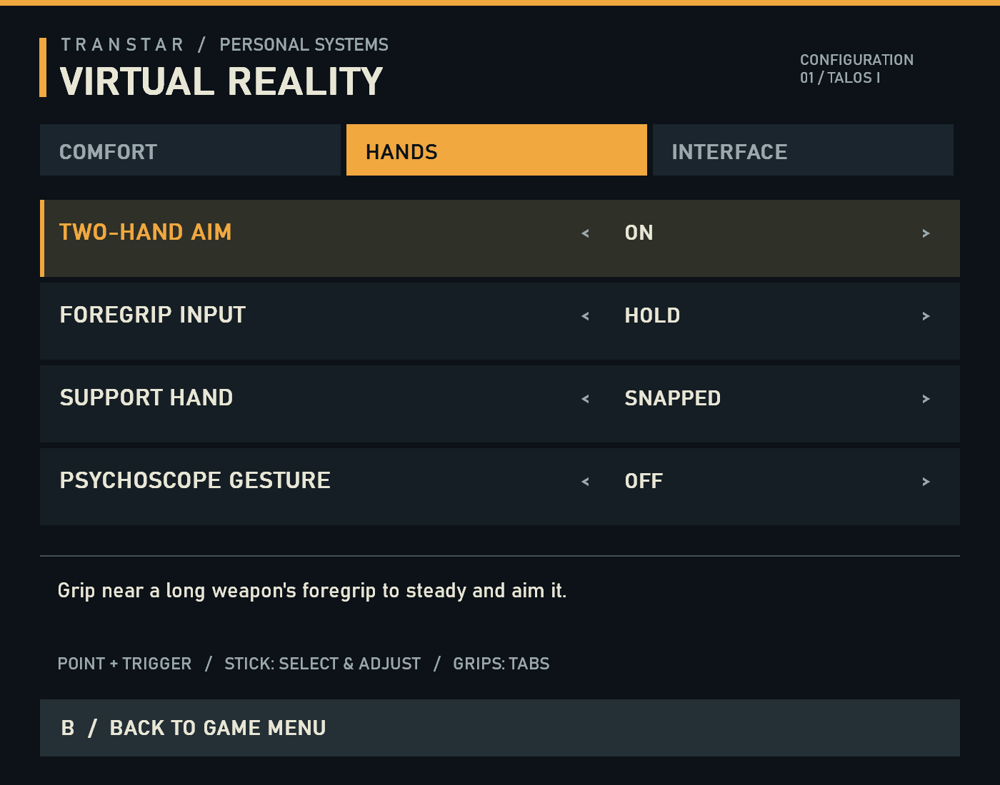

# VR options, foregrip preferences and psychoscope gesture

Base: integration commit `8270bbc435e6670fef0d76ff0449c6bc1fe6f9b0`.
Work branch: `codex/vr-options`. Holsters and wrist status remain the next batch.
No game launch, injection, live process attachment or headset test was performed.

## Implemented

The Prey-inspired options card uses charcoal, ivory and amber, large typography,
tabbed sections and the existing controller beam. It is an independent opaque
OpenXR quad with an explicit sRGB texture, fitting both eye frusta at 1.5 m with
a conservative 68% fit margin. This is a lens-safe starting point, not a measured
Quest 3 visible-FOV guarantee. It keeps its own size when game HUD scaling changes.
The same production GDI renderer creates the offline previews.



Holding left Menu for 0.65 s opens it. A short tap delivers native Start on release.
From gameplay the long hold requests native pause first; it opens the options
only after the native modal observation, with a two-second timeout. This avoids
turning a long press into pause followed by resume. A/B and stick fallback work
without a controller ray. B closes only our card, returning to the native menu.
F10 and `vr.options 1` request it while a native menu is open.

The input owner suppresses native menu navigation, cancels/releases a native
pointer drag, gates gameplay and discards queued modal presses while preserving
their required releases. Entry/exit, tracking loss and session changes require
neutral controls before another owner can act. Pointer clicks intersect the
current hand sample with the anchored panel; they do not use last-frame hover.

Preferences apply and save on the command worker. GDI repaint and GPU upload
occur only when panel content changes. The swapchain owner is the existing,
offline-tested inventory owner; images and CPU-side texture die before the XR
session. A failed panel upload closes the card and retains the native menu.
No new native UI or Scaleform vtable call is needed for the options panel.

Settings persist in `%LOCALAPPDATA%\PreyVR\vr-options.ini`, using a bounded,
versioned parser and atomic replacement. A malformed file has no partial effect.
Menu preferences supersede launcher defaults for their overlapping settings.
Resolution/reference-space remain in the launcher. See the player guide.

Two-hand aim retains the previous default (enabled, held grip, snapped visual
support hand). Toggle mode needs a fresh squeeze to attach and another to detach.
Changing weapons, tracking epoch, menu ownership or recenter invalidates it.
Free-hand mode changes the displayed support hand; the same raw two-controller
solution still steers aim and the weapon. The snap choice travels in the coherent
gameplay pose snapshot. A latched toggle grip also suppresses accidental right-grip
use/reload until detached.

The psychoscope gesture defaults off. It requires a fresh left squeeze near the
head and deliberate vertical travel, with minimum/maximum duration and lateral
limits. It cancels on invalid tracking, large frame gaps, scope preference off,
menus, owner/reference changes and an active two-handed grip. Each stroke requests
the game's native toggle exactly once. No unlock or scope state is forced.
There is no physical visor prop or gesture haptic in this batch.

## Native psychoscope proof

Target: Steam x64 `PreyDll.dll`, SHA-256
`7D6E322F61B28331095A400F0BA5F09BD9A39C57BF993602285DD6ACB05311A7`.
Ghidra program `/Prey/PreyDll.dll`, image base `0x180000000`.

| Evidence | Contract |
| --- | --- |
| `0x1709A91` | Interns `toggle_scope` into action table +0x968 |
| `0x158DC6C` | Registers handler `0x1590CC0` under that same action field |
| Player constructor `0x157A563` | Builds input at live player +0x8E0, passing the player as owner |
| Input constructor `0x158D1C0` | Vtable RVA 0x1E580E0; player backlink at +0x70 |
| Complete handler `0x1590CC0`, 208 bytes | Checks native L3 state, player movement state 10 and cinematic mode; obtains scope component and calls its toggle |
| Accessor `0x119A470` | Reads component +0xE8 from player component at player +0x678 |
| Toggle `0x1272D10` | Retains native scope availability/active-state handling |

EGS symbols supplied names to search for; all compiled offsets above were proved
on Steam. Runtime dispatch compares the **entire 208-byte native handler**,
checks the embedded receiver vtable/backlink and required non-null objects,
checks that the caller is the established input-drain thread, and disarms on a
refused/faulting native call.

The receiver comes directly from the currently executing ArkPlayer aim producer
hook, not from a cached previous-level address. The member callback uses the
existing five-argument action ABI; disassembly proves this handler only consumes
`this`. The unused action-name pointer is null deliberately.
`vr.options` reports dispatched/refused/fault counts; a returned callback is
not proof that the game accepted the request.

Raw [static extracts](evidence/vr-options-2026-09-27/psychoscope-static.txt) and
[binary verification](evidence/vr-options-2026-09-27/psychoscope-verify.json)
support this contract. Reproduce without a game:

```powershell
python tools/re/verify_psychoscope.py
cmake --build build/integration --config Release --target preyvr
ctest --test-dir build/integration -C Release --output-on-failure
```

## Validation and remaining acceptance

- 47/47 offline CTest checks passed, including new menu ownership, runtime
  adapter/persistence and production panel raster/resource checks.
- Release DLL: 1,005,056 bytes, SHA-256
  `D2FD9BCD3AA660C9FD7E7F16F298539228ABCC690D883A70AFDBE9D2B47F3E7F`.
- Launcher comfort tests also passed under Windows PowerShell 5.1.
- Toggle-grip regression cases cover weapon, mode, reference, epoch and tracking
  transitions; existing barrel-alignment integration tests remain passing.
- Native pointer dispatch tests verify that opening options cancels an existing
  inventory drag and cannot send another click behind the card.
- Static verifier checks the exact target hash, complete native handler, action
  producer/registration, embedded receiver and decoded call targets, with an
  altered-byte negative control.
- Offline preview inspected for typography, spacing and clipping. GDI resource
  count remains 3 before/after repeated warm repaints.

Still required when live tests are authorized: native pause/open/close sequence,
each settings row, persisted restart, toggle grips across weapon changes, gesture
before/after psychoscope unlock and while native scope is active, and headset
legibility/comfort. The native toggle route and gesture reach are static/harness
evidence; there is no claim of in-game or headset acceptance for this batch.

## Existing stereo inventory depth

The September 13 test already demonstrated native PDA layer-dependent binocular
disparity: zero-depth eye captures were byte-identical; at depth 100, tabs shifted
about -4 pixels, footer about -3 pixels and the item grid about 0. See
[the original pixel report](INVENTORY-STEREO-LIVE-2026-09-13.md).

That is internal stereo depth, distinct from wrapping a flat picture on a curved
panel. It does not establish internal head-motion parallax, good dialogs/cursor
behavior or headset comfort. The PDA path remains experimental and is not enabled
by this options batch.

## Research maintenance

The project-owned static receipt is in
`receipts/20260927-psychoscope-static.json`. The fleet's graph updater and receipt
intake map the canonical PreyVR root, not this integration worktree. Code graph
refresh was attempted and refused with "No fleet project is configured for root:
D:\Dev Debug\PreyVR-integration". Refresh and submit the validated receipt after
this branch reaches the canonical checkout; no fleet configuration was changed.
